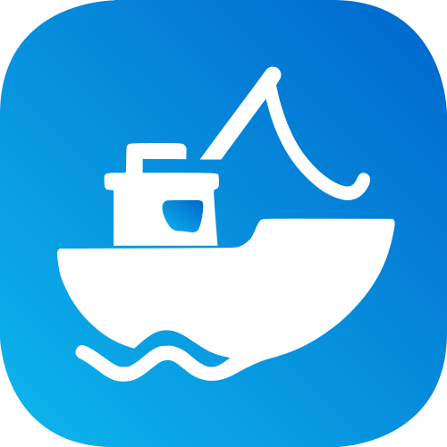

# captn Documentation

<div align="center">
  
  <h1>Intelligent Container Updater</h1>
</div>

---

## Welcome to captn

**captn** is an intelligent, rule-based container updater that automatically manages Docker container updates using semantic versioning and registry metadata. It provides a safe and controlled way to keep your containers up-to-date with configurable update policies and comprehensive verification mechanisms.

## What is captn?

captn is designed to automate the tedious task of keeping Docker containers updated while maintaining full control over what gets updated and when. Unlike simple "update everything" approaches, captn uses sophisticated rules to determine which updates are safe and appropriate for each container.

### Key Concepts

#### 1. Rule-Based Updates
captn uses configurable rules that define which types of updates are allowed for each container. For example:
- Production databases might only allow patch updates
- Development containers might accept all updates
- Security-critical services might only accept security and patch updates

#### 2. Semantic Versioning Support
captn understands semantic versioning and can differentiate between:
- **Major updates** (e.g., 1.x.x → 2.x.x): Breaking changes
- **Minor updates** (e.g., 1.1.x → 1.2.x): New features
- **Patch updates** (e.g., 1.1.1 → 1.1.2): Bug fixes
- **Build updates** (e.g., 1.1.1-1 → 1.1.1-2): Build variations
- **Digest updates**: Same tag, different image digest

#### 3. Progressive Upgrades
When multiple versions are available, captn can apply them progressively (one at a time) to ensure stability at each step, or jump directly to the latest version depending on your rule configuration.

#### 4. Verification & Rollback
After each update, captn verifies that the container starts successfully and remains stable. If an update fails, it automatically rolls back to the previous version.

## Core Features

For a complete feature overview, see the [README](https://github.com/captn-io/captn#features).

Key capabilities that make captn powerful:
- **Rule-Driven Updates**: Granular policies with conditional requirements and lag policies
- **Multi-Registry Support**: Docker Hub, GHCR, and private registries
- **Progressive Upgrades**: Sequential version updates with verification at each step
- **Safety Mechanisms**: Dry-run mode, automatic rollback, and verification periods
- **Notifications**: Real-time updates via Telegram and detailed email reports
- **Automation**: Built-in scheduler with cron support and container-specific scripts

## How captn Works

### Update Workflow

1. **Discovery**: captn scans your Docker environment for containers
2. **Filter**: Applies any filters you've specified (by name, status, etc.)
3. **Rule Evaluation**: For each container:
   - Determines which update rule applies
   - Fetches available image versions from the registry
   - Compares local version with remote versions
   - Determines update type (major, minor, patch, etc.)
4. **Pre-Script Execution**: Runs container-specific pre-update scripts
5. **Update**: Pulls new image and recreates the container
6. **Verification**: Monitors container stability for configured duration
7. **Post-Script Execution**: Runs container-specific post-update scripts
8. **Cleanup**: Removes old images and backup containers if configured
9. **Notification**: Sends update report via configured channels

### Safety Mechanisms

captn includes multiple safety mechanisms:

- **Dry-run mode**: Test without making changes
- **Backup containers**: Old containers are renamed and kept as backups
- **Verification period**: New containers must remain stable
- **Automatic rollback**: Failed updates are automatically reverted
- **Script timeouts**: Scripts have configurable execution timeouts
- **Minimal image age**: Only update images older than a specified age
- **Self-update protection**: Special handling for updating captn itself

## Documentation Structure

This documentation is organized into the following sections:

### [CLI Reference](02-CLI-Reference.md)
Complete command-line interface documentation including all parameters, filters, and usage examples.

### [Configuration](03-Configuration.md)
Comprehensive configuration reference covering all settings, sections, and options with detailed explanations and examples.

### [Pre/Post-Scripts](04-Scripts.md)
Guide to using pre-update and post-update scripts with practical examples and best practices.

## Quick Start

For installation instructions, see the [Quick Start section in the README](https://github.com/captn-io/captn#-quick-start).

After installation, configure update rules in `~/captn/conf/captn.cfg`:

```ini
[assignments]
# Assign containers to update rules
nginx = permissive
postgres = conservative
redis = patch_only
```

**Important:** Always test with `--dry-run` first:
```bash
docker exec captn captn --dry-run
```

## Use Cases

### Development Environments
Keep development containers automatically updated with the latest features:
```ini
[assignments]
dev-* = permissive
```

### Production Environments
Conservative updates with thorough verification:
```ini
[assignments]
prod-web = patch_only
prod-db = conservative
prod-cache = security_only
```

### Mixed Environments
Different rules for different services:
```ini
[assignments]
# Web servers: minor and patch updates
nginx = ci_cd
apache = ci_cd

# Databases: only patch updates
postgres = patch_only
mysql = patch_only

# Caches: all updates allowed
redis = permissive
memcached = permissive

# Critical services: security updates only
auth-service = security_only
payment-service = security_only
```

## Best Practices

### 1. Start with Dry-Run
Always test your configuration with `--dry-run` before applying updates:
```bash
docker exec captn captn --dry-run
```

### 2. Use Conservative Rules Initially
Start with conservative update rules and gradually make them more permissive as you gain confidence:
```ini
[assignments]
# Start with patch_only or conservative
myapp = patch_only
```

### 3. Test Updates in Development First
Use different rules for development and production environments.

### 4. Enable Notifications
Configure notifications to stay informed about updates:
```ini
[notifiers]
enabled = true

[notifiers.telegram]
enabled = true
token = your_bot_token
chatId = your_chat_id
```

### 5. Use Pre/Post-Scripts for Critical Services
Implement health checks and backups via scripts:
```bash
# Create container-specific scripts
~/captn/conf/scripts/database_pre.sh   # Backup before update
~/captn/conf/scripts/database_post.sh  # Verify after update
```

### 6. Monitor Logs
Regularly check captn's logs for issues:
```bash
docker logs captn
# or
tail -f ~/captn/logs/captn.log
```

### 7. Schedule Updates During Low-Traffic Periods
Configure the cron schedule to run during maintenance windows:
```ini
[general]
cronSchedule = 0 3 * * *  # 3:00 AM daily
```

### 8. Keep Backup Containers
Configure cleanup policies to retain recent backups:
```ini
[prune]
removeOldContainers = true
minBackupAge = 48h
minBackupsToKeep = 2
```

## Common Scenarios

### Scenario 1: Update a Single Container
```bash
docker exec captn captn --filter name=nginx
```

### Scenario 2: Update Multiple Specific Containers
```bash
docker exec captn captn --filter name=web-* name=api-*
```

### Scenario 3: Update All Production Containers
```bash
docker exec captn captn --filter name=prod-*
```

### Scenario 4: Test Updates Without Applying
```bash
docker exec captn captn --dry-run --filter name=production-*
```

### Scenario 5: Scheduled Daily Updates
Configure a cron schedule in your configuration:
```ini
[general]
cronSchedule = 0 2 * * *  # Daily at 2:00 AM
```
The captn container runs in daemon mode by default.

## Troubleshooting

### Container Not Being Updated

1. **Check if container matches filters**:
   ```bash
   docker exec captn captn --dry-run --filter name=mycontainer
   ```

2. **Check assigned rule**:
   - Verify rule assignment in `captn.cfg`
   - Check rule allows the available update type
   - Verify minimum image age requirement

3. **Check logs**:
   ```bash
   docker logs captn
   # or with debug level
   docker exec captn captn --log-level debug --filter name=mycontainer
   ```

### Update Failed or Rolled Back

1. **Check verification settings**:
   ```ini
   [updateVerification]
   maxWait = 480s
   stableTime = 15s
   ```

2. **Check post-scripts**:
   - Review post-script logs
   - Test post-script manually
   - Adjust timeout if needed

3. **Inspect container logs**:
   ```bash
   docker logs mycontainer
   ```

### Script Execution Failures

1. **Verify script exists and is executable**:
   ```bash
   ls -la ~/captn/conf/scripts/
   chmod +x ~/captn/conf/scripts/*.sh
   ```

2. **Test script manually**:
   ```bash
   # Set environment variables
   export CAPTN_CONTAINER_NAME=mycontainer
   export CAPTN_SCRIPT_TYPE=pre
   export CAPTN_DRY_RUN=false
   
   # Run script
   ~/captn/conf/scripts/mycontainer_pre.sh
   ```

3. **Check script timeout**:
   ```ini
   [preScripts]
   timeout = 10m  # Increase if needed
   ```

## Getting Help

- **Documentation**: Read the detailed [Configuration](03-Configuration.md), [CLI Reference](02-CLI-Reference.md), and [Scripts](04-Scripts.md) documentation
- **Logs**: Check captn's logs with debug level enabled for detailed information
- **Dry-Run**: Use dry-run mode to understand what captn would do
- **GitHub Issues**: Report bugs or request features at [GitHub Issues](https://github.com/captn-io/captn/issues)
- **GitHub Discussions**: Ask questions at [GitHub Discussions](https://github.com/captn-io/captn/discussions)

---

**Next Steps**:
- [CLI Reference →](02-CLI-Reference.md)
- [Configuration Guide →](03-Configuration.md)
- [Scripts Guide →](04-Scripts.md)

---

<div align="center">
  <p>Brewed with ❤️ and loads of 🍺</p>
</div>
